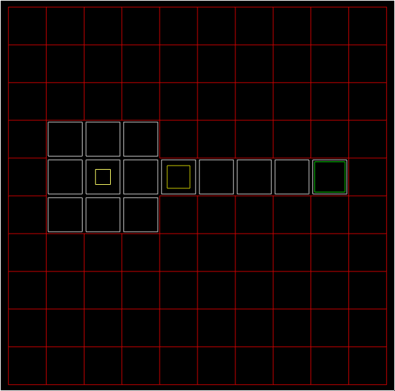

# Simple sokoban puzzle game

As a demonstration of a simplistic game with **lwjgl**.

## Description 
Each map is played on a round-like manner on a rectangular grid.
Each grid point might contain either walls, boxes, goals or the player character.
Player controls his character with arrows and tries to push boxes onto the goals.
The player wins if all goals are occupied by the boxes.

Use **Arrow** keys to move, use **R** to reset the level.

What is complete:
* described play mechanics
* player controls
* win conditiono 
* several maps

What was ommited
* menu
* settings

## Build

compile with maven

    mvn clean package
    
run as jar file

    java -jar target/sokoban.jar

## Picture

